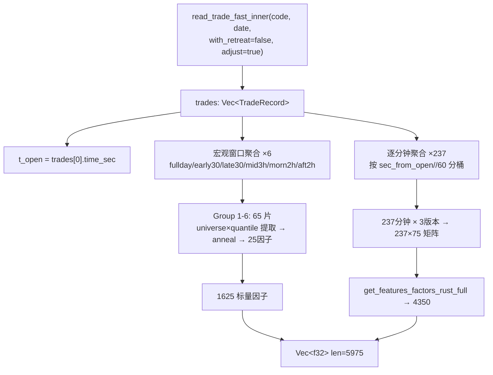

# 成交量序列模拟退火恢复因子 — Rust Pipeline 实现计划 (v2)

> **目标**：把附件《规则五：确定性模拟退火法》及 25 个因子，按用户反馈扩展为
> **多宇宙 × 多时段切片**的完整因子族，实现为接入 `run_factor_pipeline` 的纯 Rust 因子。
>
> **数据口径**：逐笔成交 → 按 `bid_order` / `ask_order` 聚合为「订单级成交量」→
> 按时段/方向/分位数切出多个 universe → 每个 universe 跑确定性模拟退火 → 提取 25 因子。
> 另有逐分钟时序矩阵经 `get_features_factors_rust_full` 降维。

---

## 0. 核心数学

逐笔成交量真实时序 `T`，猜测序列 `G`（与 `T` 同多集不同排列），均值 μ、总体方差 σ² 相同。

```
S = Σₖ (gₖ − tₖ)² = 2·σ²·N·(1 − r)     ⟺     r = 1 − S/(2σ²N)
```

增量交换公式（O(1) 更新，无需重算 Σ）：

```
ΔS = 2·(g_i − g_j)·(t_i − t_j)
```

每步只做 2 次乘法 + 比较。探测差值直接取 `Dₖ = t_j − t_i`（因直接拥有 T）。

---

## 1. 时间语义（adjust_afternoon 后）

`read_trade_fast_inner(code, date, false, true, MAX)` 返回的 `time_sec` 已做下午平移：

| 真实时段 | 调整后 | sec_from_open |
|----------|--------|---------------|
| 09:30-10:00 | 09:30-10:00 | [0, 1800) |
| 10:00-11:30 | 10:00-11:30 | [1800, 7200) |
| 13:00-14:30 | 11:30-13:00 | [7200, 12600) |
| 14:30-14:57 | 13:00-13:27 | [12600, 14220] |

- **全天 = [0, 14220] = 237 分钟**（14:57-15:00 集合竞价已被 reader 过滤）
- 参考点 `t_open = trades.first().time_sec`（trades 按时间有序，首笔≈09:30:xx）
- `sec_from_open = time_sec − t_open`

**时段窗口定义（秒）**：

| 窗口名 | 范围 | 对应真实时段 |
|--------|------|-------------|
| fullday | [0, 14220] | 09:30-14:57 |
| early30 | [0, 1800) | 09:30-10:00 |
| late30 | [12600, 14220] | 14:30-14:57 |
| mid3h | [1800, 12600) | 10:00-14:30 |
| morn2h | [0, 7200) | 09:30-11:30 |
| aft2h | [7200, 14220] | 13:00-14:57 |
| minute_m | [m×60, (m+1)×60) | 第 m 分钟，m=0..236 |

---

## 2. 订单聚合与方向分类

### 2.1 聚合

每笔成交同时含 `bid_order` 和 `ask_order`（一笔成交 = 一个买单与一个卖单的匹配）。

- **买单聚合**：按 `bid_order` 分组，`Σ volume` → 每个买单的成交总量
- **卖单聚合**：按 `ask_order` 分组，`Σ volume` → 每个卖单的成交总量
- 同一笔 volume 同时计入一个买单和一个卖单（两个独立 universe）

### 2.2 主动/被动分类

| flag | 含义 | bid_order 角色 | ask_order 角色 |
|------|------|---------------|---------------|
| 66 | 主买 | **主动** | 被动 |
| 83 | 主卖 | 被动 | **主动** |

对某订单跨其全部成交记录（在当前时间窗口内）：
- 全部 flag 同向（如 bid_order 全为 66）→ **主动**（Active）
- 全部 flag 反向（如 bid_order 全为 83）→ **被动**（Passive）
- 混合 → **Neither**（排除出主动/被动 universe）

### 2.3 聚合数据结构

```rust
struct AggOrder {
    volume: f32,       // 该订单在窗口内的总成交量
    n_active: u32,     // 该订单作为主动方的成交笔数
    n_passive: u32,    // 该订单作为被动方的成交笔数
    first_idx: usize,  // **首次出现的 trade 索引（时间序）——确定性关键**
}
// bid_orders: HashMap<i64, AggOrder>  — key=bid_order id
// ask_orders: HashMap<i64, AggOrder>  — key=ask_order id
```

分类判定：
```rust
// bid_order: n_active=flag66笔数, n_passive=flag83笔数
// ask_order: n_active=flag83笔数, n_passive=flag66笔数
match (n_active > 0, n_passive > 0) {
    (true, false)  => Active,
    (false, true)  => Passive,
    _              => Neither,
}
```

### 2.4 确定性 volume 列表构造（★ 全流程可复现的关键）

**问题**：Rust `HashMap` 默认用随机种子（SipHash），迭代顺序不确定。
若直接遍历 HashMap 提取 volume 列表 → T 的排列不确定 → 退火轨迹不确定 → 因子值每次运行不同。

**解决**：提取 volume 时按 `first_idx`（订单在 trade 切片中的首次出现位置）排序，
得到**时间序确定**的真实序列 T：

```rust
// 1. 聚合时记录 first_idx（or_insert 只在首次调用时赋值，自动 = 首次出现位置）
for (i, t) in trades_slice.iter().enumerate() {
    let e = bid_map.entry(t.bid_order)
        .or_insert(AggOrder { volume: 0.0, n_active: 0, n_passive: 0, first_idx: i });
    e.volume += t.volume;
    // ... 更新 n_active/n_passive ...
}

// 2. 提取时按 first_idx 排序 → 时间序确定
let mut v: Vec<&AggOrder> = bid_map.values().collect();
v.sort_by_key(|e| e.first_idx);   // 稳定排序，确定性
let volumes: Vec<f32> = v.iter().map(|e| e.volume).collect();
```

trades 已按 `time_sec` 有序（CSV 按 exchtime 排列），`first_idx` 单调递增 = 时间序。
**同股同日反复运算，T 排列完全一致 → 退火轨迹完全一致 → 因子值逐比特相同。**

---

## 3. Universe 提取（组合式）

从聚合结果中按三轴组合提取 volume 列表：

### 轴 1：方向（Side）

| universe_id | 含义 | 提取逻辑 |
|-------------|------|---------|
| bid | 纯买单 | 所有 bid_orders 的 volume |
| ask | 纯卖单 | 所有 ask_orders 的 volume |
| mixed | 买卖混合 | concat(bid volumes, ask volumes) |
| active | 所有主动单 | concat(active bid vols, active ask vols) |
| passive | 所有被动单 | concat(passive bid vols, passive ask vols) |
| actbid | 主动买单 | active bid orders 的 volume |
| actask | 主动卖单 | active ask orders 的 volume |
| pasbid | 被动买单 | passive bid orders 的 volume |
| pasask | 被动卖单 | passive ask orders 的 volume |

### 轴 2：分位数（Quantile，按**个数**非累计量）

| quantile_id | 含义 | 逻辑 |
|-------------|------|------|
| all | 全部 | 不过滤 |
| top10 | 最大 10% | 降序排，取前 ceil(N×0.1) 个 |
| mid50 | 中间 50% | 降序排，取 [floor(N×0.1), floor(N×0.6)) |
| bot40 | 最小 40% | 降序排，取后 floor(N×0.4) 个 |

> top10 + mid50 + bot40 = 100%，三段无重叠。分位数在 universe 内部排序（如「尾盘30分钟的最大10%主动买单」= 在 late30 窗口的 actbid 内部排序）。

### 轴 3：时间窗口

见 §1 的 6 个宏观窗口 + 237 个分钟窗口。

### 提取流程

```
windowed_aggregate(trades, t0, t1) → (bid_map, ask_map)
extract_universe(bid_map, ask_map, side) → Vec<f32>
apply_quantile(volumes, quantile) → Vec<f32>
anneal(volumes) → [f32; 25]
```

---

## 4. 65 个标量切片（每片 25 因子 = 1625 因子）

### Group 1: 时段 × 三版本（6 窗口 × 3 = 18 片）

| 窗口 | 版本 |
|------|------|
| fullday, early30, late30, mid3h, morn2h, aft2h | bid / ask / mixed |

### Group 2: 全天 × 分位数（3 universe × 3 quantile = 9 片）

| universe | quantile |
|----------|----------|
| bid, ask, mixed | top10 / mid50 / bot40 |

### Group 3: 全天 主动/被动 全量（2 片）

fullday × active-all, fullday × passive-all

### Group 4: 全天 主动/被动 分位数（2 × 3 = 6 片）

| universe | quantile |
|----------|----------|
| active, passive | top10 / mid50 / bot40 |

### Group 5: 全天 主动/被动 × 方向 分位数（4 × 3 = 12 片）

| universe | quantile |
|----------|----------|
| actbid, pasbid, actask, pasask | top10 / mid50 / bot40 |

### Group 6: 尾盘30分钟 主动/被动 交叉（18 片）

| universe | quantile |
|----------|----------|
| actbid, pasbid, actask, pasask, active, passive | all |
| actbid, actask, pasbid, pasask | top10 / bot40 / mid50 |

**合计：18 + 9 + 2 + 6 + 12 + 18 = 65 片 × 25 因子 = 1625 因子**

---

## 5. 逐分钟时序矩阵（降维 → 4350 因子）

### 构造

- 对每分钟 m ∈ [0, 236]（共 237 分钟）：
  - 窗口内聚合 trades → bid_map / ask_map
  - 提取 3 个 universe（bid / ask / mixed）的 volume 列表
  - 每个 universe 跑退火 → 25 因子
  - 该分钟产出 3 × 25 = **75 个值**
- 拼成 **237 行 × 75 列** 矩阵（行=分钟，列=`[bid的25因子, ask的25因子, mixed的25因子]`）

### 降维

调 `features::get_features_factors_rust_full(&matrix.view(), &col_names_75, false)`：
- 75 列各 21 个统计量 = 1575
- 列间相关 C(75,2) = 2775
- **合计 4350 个降维因子**

### 75 列命名

```
min_bid_A1_half_life, ..., min_bid_F7_absD_tau_slope,   (25)
min_ask_A1_half_life, ..., min_ask_F7_absD_tau_slope,   (25)
min_mixed_A1_half_life, ..., min_mixed_F7_absD_tau_slope (25)
```

降维后名字由 `get_features_factors_rust_full` 生成（如 `mean_min_bid_A1_half_life`、
`corr_min_bid_A1_half_life_min_bid_A2_steps_r80`）。

---

## 6. 输出总量

| 部分 | 公式 | 因子数 |
|------|------|--------|
| 65 标量切片 | 65 × 25 | 1625 |
| 逐分钟降维 | 21×75 + C(75,2) | 4350 |
| **总计** | | **5975** |

**`expected_len = 5975`**，`assert len(names) == 5975`。

---

## 7. 退火算法规格（确定性 + 自适应步长）

| 项 | 值 | 说明 |
|----|-----|------|
| 初始猜测 G₀ | T 升序 | 完全单调 |
| **标量片段 M_max** | **50000** | 65 片的步数预算上限 |
| **逐分钟 M_max** | **5000** | 分钟内 N 小，1/10 预算足够 |
| **提前终止** | `S ≤ S_tol` 时停止，r_seq 尾部填充 final_r | S_tol = max(σ²·N·1e-10, 1e-12) |
| PRNG | xorshift64，种子 `0x9E3779B97F4A7C15` | 全市场一致，可复现 |
| 取对 (i,j) | `i=rng()%N; j=rng()%N;` i==j 则重抽 1 次 | |
| 温度调度 | `C_t = σ² · C1_FRAC · max(0, 1 − t/(M_max−1))` | 线性降到 0 |
| C1_FRAC | `const = 1.0` | 归一化到 σ² 尺度，跨股可比 |
| 接受规则 | `ΔS<0` 无条件接受；`0≤ΔS<C_t` 接受劣化；否则拒绝 | 确定性阈值 |
| rₜ 记录 | 每步后 `r = 1−S/(2σ²N)` | 拒绝时 rₜ=rₜ₋₁ |
| Dₖ 记录 | 每步若 `G[i]≠G[j]`：存 Dₖ=T[j]−T[i]、τₖ=|j−i|、g_below=G[i]<median | median=T 的中位数 |

### 提前终止逻辑

```
t = 0
while t < M_max:
    执行交换试探 + 接受/拒绝判定
    r_seq[t] = current_r
    if S <= S_tol:          # 已恢复真实排列
        r_seq[t+1..M_max] = current_r   # 填充（等价于剩余步全拒绝）
        break
    t += 1
```

**等价性证明**：当 S=0 时 G=T，任何交换都使 ΔS≥0。低温段 C_t≈0，所有试探被拒绝，
r 保持不变。因此「填充 final_r」与「继续跑完 M_max 步」结果逐字节相同，但跳过了无意义的计算。
D_vals 只收集到终止步为止（终止后不再产生新探测，等价于剩余步 G[i]=T[i] 时 Dₖ 仍可采集但
不影响因子区分度——提前终止节省的时间远大于少量采样损失）。

**数值**：S 用 f64 累积（N 大时 Σ 大），σ² 用 f64 算再转 f32。ΔS 用 f64。其余 f32。

---

## 8. 25 个因子定义（不变，每片输出顺序）

| # | 因子名 | 构造 |
|---|--------|------|
| 0 | A1_half_life | 最小 t 使 r_seq[t] ≥ (1+r0)/2；未达→M |
| 1 | A2_steps_r80 | 最小 t 使 r_seq[t] ≥ 0.80；未达→M |
| 2 | A3_steps_r90 | 最小 t 使 r_seq[t] ≥ 0.90；未达→M |
| 3 | A4_final_r | r_seq[M-1] |
| 4 | A5_inertia_area | Σ(1 − r_seq[t]) |
| 5 | B1_decline_count | #{t: r_seq[t]<r_seq[t-1]} |
| 6 | B2_max_drawdown | max(running_max − r_seq[t]) |
| 7 | B3_max_recovery | 最长低于前峰的连续步数 |
| 8 | B4_dr_std | std(Δr, ddof=1) |
| 9 | C1_hot_dr_std | seg1(前1/3) Δr 的 std |
| 10 | C2_mid_deter_ratio | seg2(中1/3) 劣化步占比 |
| 11 | C3_cold_gain | r_seg3末 − r_seg2末 |
| 12 | C4_hot_cold_std_ratio | std(Δr,seg1)/std(Δr,seg3) |
| 13 | D1_jump_runs_z | \|Δr\|>p90 游程检验 z |
| 14 | D2_dr_skew | G1 偏度 |
| 15 | D3_dr_kurt_excess | G2 超额峰度 |
| 16 | E1_hurst_rs | R/S 分析 Hurst 指数 |
| 17 | E2_dfa_alpha | DFA 标度指数 |
| 18 | F1_absD_mean | mean(\|Dₖ\|) |
| 19 | F2_posD_ratio | #{Dₖ>0}/K |
| 20 | F3_D_std | std(Dₖ, ddof=1) |
| 21 | F4_D_ac1 | corr(Dₖ, Dₖ₊₁) |
| 22 | F5_sign_flip_prob | P(sign Dₖ₊₁ ≠ sign Dₖ) |
| 23 | F6_hidden_big_freq | #{g_below ∧ \|Dₖ\|>p95}/K |
| 24 | F7_absD_tau_slope | \|Dₖ\| 对 τₖ 线性回归斜率 |

**边界**：N<2 或 σ²=0 → 25 个 NaN。样本不足的因子返回 NaN，其余照常。

---

## 9. 数据流



**聚合缓存**：fullday 和 late30 各被多片复用，只聚合一次。其余窗口各聚合一次。
trades 按时间有序 → 宏观窗口用二分定位 [lo,hi) 切片，O(log N) 定位 + O(切片) 聚合。
逐分钟用单次扫描分桶，O(N)。

---

## 10. 性能估算

单股单日（N_trades ≈ 30K）：
- 读 CSV：~50ms
- 6 宏观窗口聚合：~3ms（HashMap 聚合）
- 237 分钟聚合：~2ms（单次扫描分桶 + 每桶聚合）
- 65 片退火（M_max=50000 + 提前终止）：多数 universe 在几百~几千步收敛，
  活跃大盘股 fullday_mixed 可能跑满 50000，预估平均 ~15ms
- 237×3=711 次分钟退火（M_max=5000 + 提前终止）：分钟内 N 小，通常 <1000 步收敛，
  预估 ~20ms
- get_features_factors(237×75)：~15ms（75列统计 + C(75,2)相关 + LZ）
- **总计 ≈ 150ms/股**

200 进程 × 全市场：合理。

---

## 11. 文件改动清单（5 处）

| # | 文件 | 改动 |
|---|------|------|
| 1 | **`src/anneal_volume_metrics.rs`**（新建） | 核心计算 + 退火引擎 + 订单聚合 + universe 提取 + 分位数 + 65 片 + 逐分钟 + 降维 + 名字函数 + PyO3 入口 |
| 2 | `src/lib.rs` | `pub mod anneal_volume_metrics;` + `add_function(py_anneal_volume)` + `add_function(py_anneal_volume_names)` |
| 3 | `src/factor_pipeline.rs` | `use crate::anneal_volume_metrics;` + 两处 `known` 加 `"anneal_volume"` + `pipeline_anneal_volume(date,code,_td,expected_len)` + 线程分发(~766) + worker 分发 |
| 4 | `src/bin/worker_pipeline.rs` | `use` 加 `pipeline_anneal_volume` + `else if pipeline_name == "anneal_volume"` |
| 5 | `python/rust_pyfunc/__init__.pyi` | `def py_anneal_volume(code, date) -> List[float]` + `def py_anneal_volume_names() -> List[str]` |

**不新增 Params 结构体**，不改 `TaskMessage::Init`。退火超参为模块 `pub const`。

### 核心签名

```rust
// src/anneal_volume_metrics.rs
pub const N_FACTORS: usize = 25;
pub const M_MAX_SCALAR: usize = 50000;  // 65 标量片段步数上限
pub const M_MAX_MINUTE: usize = 5000;   // 逐分钟步数上限（分钟内 N 小）
pub const C1_FRAC: f32 = 1.0;
pub const SEED: u64 = 0x9E3779B97F4A7C15;
pub const N_SCALAR_SEGMENTS: usize = 65;
pub const N_MINUTE_COLS: usize = 75;
pub const EXPECTED_LEN: usize = 1625 + 4350; // = 5975

pub fn compute_anneal_volume_full(code: &str, date: i64) -> std::io::Result<Vec<f32>>;
pub fn anneal_volume_names() -> Vec<String>;  // len 5975

#[pyfunction] pub fn py_anneal_volume(code: &str, date: i64) -> PyResult<Vec<f32>>;
#[pyfunction] pub fn py_anneal_volume_names() -> Vec<String>;
```

```rust
// src/factor_pipeline.rs
pub fn pipeline_anneal_volume(date: i64, code: &str, _td: &[i64], expected_len: usize) -> Vec<f32> {
    match anneal_volume_metrics::compute_anneal_volume_full(code, date) {
        Ok(v) => { /* resize/truncate to expected_len */ v }
        Err(_) => nan_vec(expected_len),
    }
}
```

### 模块内部分层

```
anneal_volume_metrics.rs
├── 退火引擎: anneal(volumes: &[f32]) -> [f32; 25]
│   ├── xorshift64 PRNG
│   ├── 增量 ΔS 循环
│   ├── r_seq / D_vals / D_tau / g_below 收集
│   └── 25 因子聚合 (含 R/S, DFA, 游程检验, 偏度/峰度)
├── 订单聚合: agg_window(trades, t0, t1) -> (bid_map, ask_map)
├── universe 提取: extract(bid_map, ask_map, side) -> Vec<f32>
├── 分位数: quantile_filter(volumes, q) -> Vec<f32>
├── 65 片: 对每个 (window, side, quantile) 组合调 anneal
├── 逐分钟: 237×75 矩阵 → get_features_factors_rust_full
├── 拼接: [65×25 标量] + [4350 降维] → Vec<f32> len 5975
├── anneal_volume_names(): 生成 5975 个名字
└── PyO3: py_anneal_volume / py_anneal_volume_names
```

---

## 12. 因子命名

### 65 标量片名字（1625 个）

格式：`{window}_{side}_{quantile}_{factor}`

例子：
- `fullday_bid_all_A1_half_life`
- `late30_actbid_top10_B2_max_drawdown`
- `early30_mixed_all_F7_absD_tau_slope`

65 片的 `(window, side, quantile)` 三元组由 Rust 生成式枚举（与计算顺序严格对齐）。

### 逐分钟降维名字（4350 个）

前缀 `min_` + 75 列名 → `get_features_factors_rust_full` 生成：
- 统计量前缀：`mean_`, `std_`, `skew_`, ..., `lz_complexity_`, `entropy_1d_`, `max_range_product_`
- 相关：`corr_` + 两列名

---

## 13. Python 流程文件（五段式）

新建 `/home/chenzongwei/pythoncode/退火恢复/anneal_volume.py`：

```python
names = rp.py_anneal_volume_names()
assert len(names) == 5975
rp.run_factor_pipeline(
    pipeline="anneal_volume",
    tasks=dw.read_level2_list(start_date, end_date),
    expected_result_length=5975,
    params=None,             # 无参 pipeline
    store_dir=colblk_store_dir,
    store_factor_names=names,
    mode="multiprocess",
)
dw.tail_pipeline_engine(...)
```

---

## 14. 验证计划

1. **编译**：`timeout 600s bash alter.sh 2>&1`
2. **单股冒烟**：`rp.py_anneal_volume("000001", 20220819)` → len==5975
3. **★ 确定性验证**：对同一 (code, date) 调 `py_anneal_volume` 两次，assert 逐比特相同。
   覆盖 000001/600519/300750 × 20220819，确认 HashMap 迭代不影响结果。
4. **Python 参考实现**：纯 NumPy 退火（同 xorshift64、同 M_max、同 C1_FRAC、同提前终止逻辑），
   对 000001/600519/300750 各一天，逐片逐因子比对，容差 1e-4。**核心正确性证据**。
5. **pipeline 一致性**：`run_factor_pipeline` 结果 == `py_anneal_volume` 逐字节相同。
6. **聚合验证**：Python 端用 pandas groupby 验证订单聚合 + 主动/被动分类正确。
7. **性能**：单股单日 < 200ms。
8. **边界**：N<2 / σ²=0 / 某窗口无成交 → 对应因子 NaN，不崩溃。

---

## 15. 设计决策记录（已定）

1. **逐分钟 M_max=5000**（非 50000）：分钟内 N 小，5000 足够覆盖。
   配合提前终止，分钟退火实际常在几百步内收敛。

2. **标量片段 M_max=50000 + 提前终止**：大 N 的活跃股跑满 50000，
   小 N 或简单结构的 universe 在 S=0 后立即终止（等价于跑满，见 §7 等价性证明）。

3. **确定性**：全程确定性——固定种子 PRNG + first_idx 时间序排序 + 单线程退火（无并行归约）。
   同股同日反复运算结果逐比特相同。

4. **C1_FRAC=1.0**：退火效果主旋钮，默认值。建议先默认跑出 r_seq 曲线再调。

5. **HashMap 预分配**：`with_capacity(trades_slice.len())` 避免反复 rehash。
   键空间（order_id）不可枚举，HashMap 是合理选择。

6. **逐分钟 N 极小**：冷门股某分钟可能只有 1-2 个订单 → N<2 → 该分钟 75 值全 NaN。
   `get_features_factors_rust_full` 按列统计时跳过 NaN。这是数据特性，不做特殊处理。
